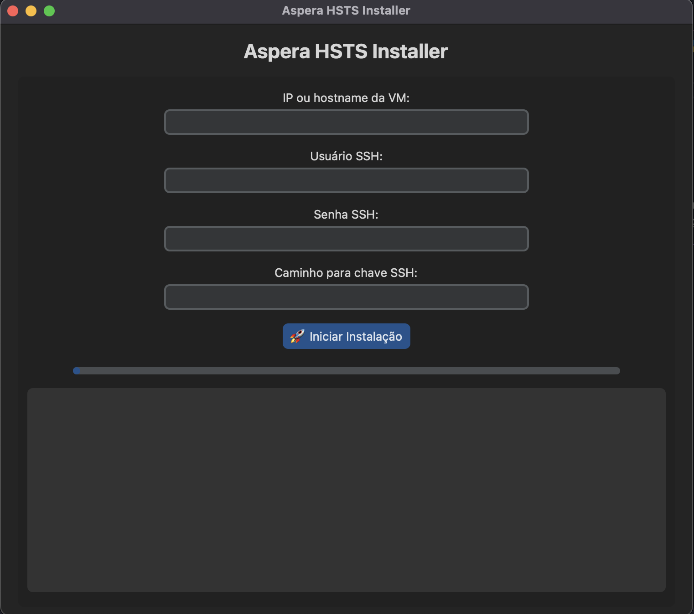

# 📦 Aspera HSTS Installer

Uma aplicação de automação para instalação e licenciamento do **IBM Aspera High-Speed Transfer Server (HSTS)** em máquinas Linux via SSH.  
Feita para agilizar demonstrações, POCs e deployments em ambientes controlados.

> 🛠️ Desenvolvido com: `Python + Paramiko + CustomTkinter + GDown`  
> 🎨 Interface simples e amigável, voltada para produtividade no campo.

---

## 🚀 Funcionalidades

- ✅ Conexão remota via SSH (senha ou chave)
- 📥 Download automático do instalador adequado para o sistema detectado
- 📂 Envio do instalador e da licença via SFTP
- ⚙️ Instalação automatizada do HSTS
- 🔐 Aplicação da licença Aspera automaticamente
- 🎛️ Interface gráfica intuitiva com feedback de progresso

---

## 🖥️ Requisitos

- Python 3.8+
- Sistemas operacionais suportados:
  - Debian/Ubuntu
  - RHEL/CentOS
  - AIX (parcial)

Instale as dependências com:

```bash
pip install paramiko gdown customtkinter pillow
```

---

## ▶️ Como Executar

```bash
python installer.py
```

---

## 💻 Interface Gráfica (GUI)

Criada com **CustomTkinter**, possui os campos:

- IP ou Hostname da VM
- Usuário SSH
- Senha SSH (campo mascarado)
- Caminho para chave SSH (opcional)
- Botão: "🚀 Iniciar Instalação"
- Barra de progresso
- Área de log em tempo real

---

## 🔄 Etapas da Automação

### 1. Conexão SSH

```python
self.conectar_ssh(host, user, password, key_path)
```

Autenticação via senha ou chave SSH. Aceita hosts automaticamente.

---

### 2. Detecção do Sistema Operacional

```python
self.detect_os(ssh)
```

Lê `/etc/os-release` e retorna:
- `debian` (inclui Ubuntu)
- `rhel` (inclui CentOS)
- `aix` (em breve)
- `linux_genérico` (fallback)

---

### 3. Download do Instalador

```python
self.baixar_instalador(os_type)
```

Baixa automaticamente via Google Drive com o pacote correto para o sistema identificado.

---

### 4. Upload do Instalador via SFTP

```python
self.send_file(ssh, local_path, remote_path)
```

Envia o instalador para `/tmp` na VM, com progresso visual.

---

### 5. Execução da Instalação

```python
self.install_package(ssh, os_type, remote_path)
```

Executa o comando correspondente ao SO:
- `dpkg` para Debian
- `rpm` para RHEL
- `sh` para AIX
- `tar` para genéricos

---

### 6. Licenciamento

```python
self.buscar_licenca()
```

Seleciona uma `.aspera-license` aleatória da pasta `licenses_aspera/`.

```python
self.garantir_diretorio_licenca(ssh)
self.mover_licenca_para_diretorio_final(ssh, remote_path)
```

Cria o diretório final e move a licença para `/opt/aspera/etc/`.

```python
self.aplicar_licenca(ssh)
```

Executa `ascp -A` para aplicar e validar a licença.

---

## 🛠️ Tecnologias Utilizadas

| Tecnologia       | Função                                      |
|------------------|---------------------------------------------|
| Python 3         | Linguagem base                              |
| customtkinter    | Interface gráfica moderna                   |
| paramiko         | Conexão SSH e SFTP                          |
| gdown            | Download via Google Drive                   |
| Pillow (PIL)     | Imagem do logo (opcional)                   |
| threading        | Execução assíncrona na GUI                  |

---

## 📸 Tela da Interface

> 


## ⚠️ Sobre a pasta `licenses_aspera`

Essa pasta deve conter **licenças `.aspera-license` válidas** para instalação do HSTS.

🚫 **Importante**: por motivos legais, as licenças **não estão incluídas** neste repositório.  
📁 Para testar o instalador, coloque manualmente suas licenças dentro da pasta `licenses_aspera/`.

📌 Para manter a pasta no repositório mesmo vazia, foi utilizado um arquivo oculto: `.gitkeep`.

---

## 🛡️ Disclaimer

Este projeto é **exclusivamente para fins educacionais e demonstração**.  
O uso do IBM Aspera e de suas licenças deve estar em conformidade com os **termos e políticas da IBM**.

---

## 👨‍💻 Autor

**Guilherme Alves**  
🧠 IT Automation Tech Sales @ IBM  
🌐 [github.com/guilhermeaalves](https://github.com/guilhermeaalves)  
🔗 [linkedin.com/in/guilhermeaalves](https://linkedin.com/in/guilhermeaalves)